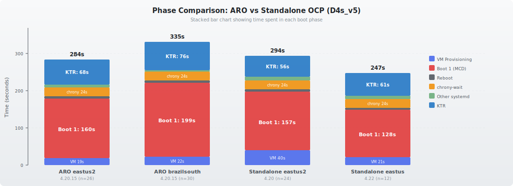

# ARO (Azure Red Hat OpenShift) Node Scale-Up Timing

Measuring node scale-up time on ARO across regions, and comparing with standalone OCP clusters to understand the impact of managed infrastructure and the IDMS container registry mirror.

> **Current data**: ARO 4.20.15 on Standard_D4s_v5 in eastus2 (26 samples) and brazilsouth (30 samples).

## Why ARO

ARO is a managed OpenShift offering on Azure. The control plane is operated by Microsoft and Red Hat — customers manage only worker nodes. We want to understand whether the managed infrastructure adds or reduces overhead to node scale-up time, and how regional placement and the IDMS registry mirror affect performance.

## Test Matrix

### ARO Clusters

| VM Type | Region | OCP Version | Scale-Up Time | Samples |
|---------|--------|-------------|---------------|---------|
| Standard_D4s_v5 (4 vCPU, 16 GB) | eastus2 | 4.20.15 | **4m 44sec ± 11s** | 26 |
| Standard_D4s_v5 (4 vCPU, 16 GB) | brazilsouth | 4.20.15 | **5m 35sec ± 40s** | 30 |

### For comparison: OCP Standalone

| VM Type | Region | OCP Version | Scale-Up Time | Samples |
|---------|--------|-------------|---------------|---------|
| Standard_D4s_v5 | eastus2 | 4.20 | **4m 54sec ± 49s** | 24 |
| Standard_D4s_v5 | eastus | 4.22 | **4m 07sec ± 11s** | 12 |

## Key Findings

### ARO is 10s faster than standalone OCP in the same region

ARO eastus2 averages **284s (4m 44sec)** — 10s faster than standalone OCP eastus2 (294s). The IDMS mirror (arosvc.azurecr.io) adds ~11s to CNI image pulls, but ARO's faster VM provisioning (−21s) more than compensates.

| Phase | ARO eastus2 | Standalone eastus2 | Delta |
|-------|-------------|-------------------|-------|
| VM Provisioning | 18.5s | 39.6s | **−21s** |
| Boot 1 (rpm-ostree rebase) | 160s | 157s | +3s (neutral) |
| KTR (CNI image pulls) | 67.5s | 56.1s | +11s |
| **Total** | **284s** | **294s** | **−10s** |

### The Brazil region adds 51s — not ARO itself

ARO brazilsouth is 51s slower than ARO eastus2 (335s vs 284s). The difference is entirely in network-bound phases:

- **Boot 1 (rpm-ostree rebase)**: +39s — pulling the machine-os image from distant registries
- **Kubelet to NodeReady (CNI image pulls)**: +8s — same cause

### IDMS mirror: required for connectivity, neutral for Boot 1, +11s for KTR

All ARO image pulls go through `arosvc.azurecr.io` via the ImageDigestMirrorSet. Journal analysis confirms:

- **Boot 1**: arosvc.azurecr.io adds no measurable overhead vs direct quay.io (160s vs 157s in eastus2)
- **KTR (CRI-O pulls)**: arosvc.azurecr.io is 11s slower than direct quay.io in the same region (67.5s vs 56.1s), possibly because quay.io uses CDN edge locations
- **Without IDMS**: nodes cannot bootstrap at all — quay.io is blocked from the ARO network

### Where the time goes (ARO eastus2, 4m 44sec)

| Phase | Duration | % of Total |
|-------|----------|------------|
| Boot 1 (Ignition + MCD firstboot) | 160s | 56% |
| Kubelet to NodeReady (CSR + CNI pulls) | 68s | 24% |
| chrony-wait (NTP sync) | 24s | 8% |
| VM Provisioning | 19s | 7% |
| Reboot + other systemd | 13s | 5% |
| **Total** | **284s** | **100%** |

### Where the time goes (ARO brazilsouth, 5m 35sec)

| Phase | Duration | % of Total |
|-------|----------|------------|
| Boot 1 (Ignition + MCD firstboot) | 199s | 59% |
| Kubelet to NodeReady (CSR + CNI pulls) | 76s | 23% |
| chrony-wait (NTP sync) | 24s | 7% |
| VM Provisioning | 22s | 7% |
| Reboot + other systemd | 10s | 3% |
| **Total** | **335s** | **100%** |

### Variance

ARO eastus2 has the **lowest variance of any cluster tested** (stdev 11.1s). No outlier rounds, no zonal differences. ARO brazilsouth had higher variance (40.1s), with rounds 9-10 as outliers driven by transient I/O contention.

| Cluster | Mean | Stdev | Min | Max |
|---------|------|-------|-----|-----|
| ARO eastus2 | 284s | 11s | 268s | 307s |
| ARO brazilsouth | 335s | 40s | 293s | 430s |
| Standalone eastus2 | 294s | 49s | 232s | 422s |
| Standalone eastus | 247s | 11s | 230s | 266s |

### chrony-wait: identical across all Azure deployments

| Deployment | Region | chrony-wait |
|-----------|--------|-------------|
| ARO | eastus2 | 24.07s ± 0.007s |
| ARO | brazilsouth | 24.07s ± 0.007s |
| Standalone OCP 4.20 | eastus2 | 24.07s ± 0.008s |
| Standalone OCP 4.22 | eastus | 24.07s ± 0.005s |

Azure's PHC refclock (`/dev/ptp_hyperv`) produces the same deterministic 24.07s sync time regardless of region, OCP version, or deployment model.

## Full Comparison Table

| Metric | ARO eastus2 4.20 | ARO brazilsouth 4.20 | Standalone eastus2 4.20 | Standalone eastus 4.22 |
|--------|-----------------|---------------------|------------------------|----------------------|
| **Total** | **284s (4m 44sec)** | **335s (5m 35sec)** | **294s (4m 54sec)** | **247s (4m 07sec)** |
| VM Provisioning | 18.5s | 21.8s | 39.6s | 20.5s |
| Boot 1 | 160s | 199s | 157s | 128s |
| Reboot | 5.8s | 6.1s | 6.1s | 5.4s |
| chrony-wait | 24.07s | 24.07s | 24.07s | 24.07s |
| systemd-analyze | 33.0s | 28.4s | 34.3s | 33.1s |
| KTR | 67.5s | 75.5s | 56.1s | 60.6s |
| Total stdev | 11.1s | 40.1s | 49.0s | 11.3s |
| Samples | 26 | 30 | 24 | 12 |

## Optimization Opportunities for ARO

The same optimizations from standalone OCP apply, with **higher ROI in distant regions**:

| Optimization | Estimated Savings | Notes |
|-------------|-------------------|-------|
| Regional container registry mirror | 40-60s | Would eliminate the Brazil→US registry penalty |
| Pre-cache machine-os image in base OS | 50-120s | Eliminates the largest phase entirely |
| Pre-pull CNI images into base image | 20-30s | Reduces KTR from 76s to ~50s |

### Not worth optimizing (same as standalone)

- More vCPUs: MCD firstboot is I/O-bound, not CPU-bound
- chrony tuning: 24s is a fixed cost on Azure, not tunable via chrony config

## IDMS (ImageDigestMirrorSet) Dependency

ARO clusters include an ImageDigestMirrorSet (`image-digest-mirror`) that redirects all `quay.io/openshift-release-dev/*` pulls to `arosvc.azurecr.io`. This is not just a performance optimization — **it is required for node bootstrapping**.

### Without IDMS: nodes cannot bootstrap

When we deleted the IDMS and waited for the MachineConfigPool to roll out the change to existing workers, new nodes created afterward were stuck at `Provisioned` indefinitely (38+ minutes) with no nodeRef. The VMs were running but never registered as nodes — MCD firstboot could not pull images because **quay.io appears to be blocked from the ARO Azure network**.

The MachineHealthCheck detected them as unhealthy but `maxUnhealthy="1"` prevented remediation of 3 simultaneously unhealthy machines.

Serial console logs were not available (`az vm boot-diagnostics get-boot-log` returned "Please enable boot diagnostics" — boot diagnostics are not enabled on ARO-provisioned VMs).

### With IDMS restored: immediate recovery

After restoring the IDMS from `aro/IMDS.yaml` and waiting for MCPs to finish rolling out, a verification round of 3 nodes (one per zone) bootstrapped successfully:

| Zone | Total | VM Prov | Boot 1 | Reboot | KTR | chrony |
|------|-------|---------|--------|--------|-----|--------|
| 1 | 329s | 26s | 201s | 8s | 63s | 24.06s |
| 2 | 329s | 21s | 211s | 6s | 60s | 24.07s |
| 3 | 327s | 25s | 199s | 7s | 65s | 24.06s |
| **Mean** | **328s** | **24s** | **204s** | **7s** | **63s** | **24.06s** |

These timings are consistent with the original 10-round data (mean 335s ± 40s). KTR is slightly better at 63s vs 76s, likely due to less contention with a single round.

### Which registry is actually used?

Journal analysis from the verification round confirms:

- **Boot 1 (MCD firstboot)**: Ignition writes `/etc/containers/registries.conf` with mirror configuration before MCD firstboot starts. Podman logs reference `quay.io/...` as the image name, but the pull is redirected through `arosvc.azurecr.io` via registries.conf.
- **Boot 2 (CRI-O pulls)**: CRI-O explicitly logs `Trying to access "arosvc.azurecr.io/openshift-release-dev/ocp-v4.0-art-dev@sha256:..."` — confirmed mirror usage.

All image pulls on ARO go through `arosvc.azurecr.io`. There is no direct comparison between quay.io and arosvc.azurecr.io pull speeds because quay.io is not reachable from the ARO environment.

### IDMS definition

The IDMS is saved in `aro/IMDS.yaml` and mirrors three quay.io paths:
- `quay.io/openshift-release-dev/ocp-release` → `arosvc.azurecr.io/openshift-release-dev/ocp-release`
- `quay.io/openshift-release-dev/ocp-release-nightly` → `arosvc.azurecr.io/openshift-release-dev/ocp-release-nightly`
- `quay.io/openshift-release-dev/ocp-v4.0-art-dev` → `arosvc.azurecr.io/openshift-release-dev/ocp-v4.0-art-dev`

## Data

All test artifacts are in `reports/`:

### ARO eastus2
- Analysis: `scale-up-analysis-aro-eastus2-d4s-v5-variance.md`
- Per round/zone: `*-aro-eastus2-d4s-v5-r{1-10}-z{1-3}.*` (machinesets, machine/node YAML, boot lists, systemd data, images, full journals)
- Worker ignition config: `rendered-worker-ignition-aro-eastus2.json`

### ARO brazilsouth
- Analysis: `scale-up-analysis-aro-d4s-v5-variance.md`
- Per round/zone: `*-aro-d4s-v5-r{1-10}-z{1-3}.*` (machinesets, machine/node YAML, boot lists, systemd data, images)
- IDMS verification round: `*-aro-d4s-v5-idms-verify-z{1-3}.*` (includes full journals proving mirror usage)

### IDMS
- IDMS definition: `aro/IMDS.yaml`
