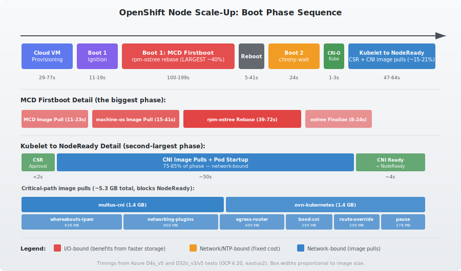
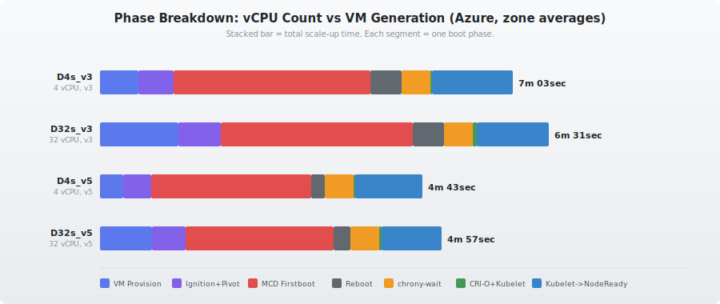
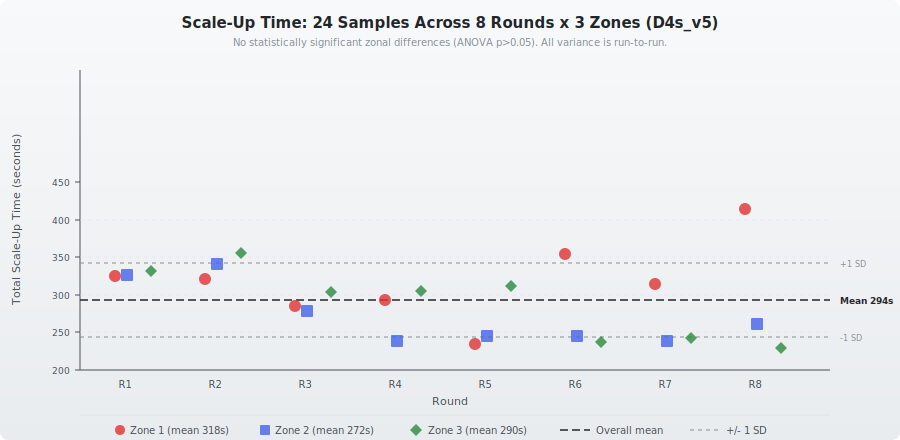

# OpenShift Node Scale-Up Timing

Measuring and analyzing how long it takes for a new worker node to go from MachineSet creation to `NodeReady` in OpenShift clusters, broken down by boot phase.

> **Current baseline**: OCP 4.22. Earlier 4.18 data is archived in `reports/archive/`.

## Why

Node scale-up time directly impacts cluster autoscaler responsiveness and workload scheduling latency. Understanding where time is spent — cloud provisioning, OS bootstrapping, container image pulls, NTP sync — identifies which optimizations actually matter.

## Boot Phase Sequence

Every new OpenShift node goes through these phases between MachineSet creation and NodeReady:



## Test Matrix

### OCP Standalone — Azure

| VM Type | OCP 4.20 (eastus2) | OCP 4.22 (eastus) |
|---------|-------------------|-------------------|
| Standard_D4s_v5 (4 vCPU, 16 GB) | **4m 54sec ± 21s**\* | **4m 07sec ± 7s**\*\* |
| Standard_D32s_v3 (32 vCPU, 128 GB) | 6m 31sec (avg, 3 zones) | — |
| Standard_D32s_v5 (32 vCPU, 128 GB) | 4m 57sec (avg, 3 zones) | — |

\* 24 samples (8 rounds x 3 zones). See [Variance Analysis](#run-to-run-variance-is-large-zonal-variance-is-not).
\*\* 12 samples (4 rounds x 3 zones). Mean 247s, stdev 11s — much lower variance than 4.20.

### OCP Standalone — AWS (OCP 4.21, us-west-2)

| Instance Type | CPU Gen | Scale-Up Time | With chrony tuning |
|--------------|---------|---------------|--------------------|
| m6a.xlarge (4 vCPU, 16 GB) | AMD EPYC 3rd Gen | 4m 26sec | — |
| m7a.xlarge (4 vCPU, 16 GB) | AMD EPYC 4th Gen | 4m 19sec | — |
| m8a.xlarge (4 vCPU, 16 GB) | AMD EPYC 5th Gen | 3m 32sec | 3m 38sec\*\* |

\*\* chrony-wait showed high variance across runs (7s, 13s, 20s) — see [Chrony Tuning Experiments](#chrony-tuning-experiments) below.

### ARO (Azure Red Hat OpenShift) — Managed

| VM Type | Region | OCP Version | Scale-Up Time | Samples |
|---------|--------|-------------|---------------|---------|
| Standard_D4s_v5 | eastus2 | 4.20.15 | **4m 44sec ± 11s** | 26 |
| Standard_D4s_v5 | brazilsouth | 4.20.15 | **5m 35sec ± 40s** | 30 |

See [ARO.md](ARO.md) for detailed ARO analysis including IDMS mirror impact.

### HyperShift / ROSA HCP — AWS (OCP 4.20, us-east-1)

| Instance Type | Scale-Up Time | Notes |
|--------------|---------------|-------|
| m5.xlarge (4 vCPU, 16 GB) | **4m 34sec** (mean, n=4) | Hosted control plane |
| t3.large (2 vCPU, 8 GB, burstable) | **5m 35sec** (n=1) | 22% slower — burstable CPU |

## Key Findings

### VM generation is the dominant factor

On Azure (4.20), D32s_v5 is **24% faster** than D32s_v3 (4m 57sec vs 6m 31sec). The v5 generation saves time across every phase: VM provisioning (22s), MCD firstboot (37s from better I/O), kubelet-to-NodeReady (10s from faster image pulls).

On AWS (4.21), m8a is **20% faster** than m6a (3m 32sec vs 4m 26sec). The improvement comes from faster NVMe storage (dramatically speeds up rpm-ostree rebase) and faster CPU/POST times.

### Larger instances don't hurt total scale-up time

We tested 32-vCPU instances (D32s) to verify that larger VMs don't introduce a provisioning penalty that would hurt autoscaler responsiveness. The results show that **VM provisioning is slower** for larger instances (43-65s vs 40s avg), but total scale-up time stays comparable because faster container image pulls offset the provisioning cost.



| Phase | D4s_v5 (4 vCPU) | D32s_v5 (32 vCPU) | Impact |
|-------|-----------------|-------------------|--------|
| VM provisioning | 40s (avg) | 43s (avg) | **Comparable** on v5 |
| MCD firstboot (rpm-ostree) | 2m 37sec (avg) | 2m 03sec (avg) | **Faster** at 32 vCPU |
| Kubelet to NodeReady | 56s (avg) | 50s (avg) | **Slightly faster** — image pulls parallelize |
| chrony-wait | 24s | 24s | **Identical** — NTP/network bound |
| **Total** | **4m 54sec** | **4m 57sec** | **Net comparable** |

D32s_v3 averages 6m 31sec — the generation upgrade matters more than instance size. Instance size should be chosen for workload needs, not scale-up speed.

### Where the time goes (best case: AWS m8a, ~3.5 minutes)

| Phase | Duration | % |
|-------|----------|---|
| MCD firstboot (rpm-ostree rebase) | 1m 10sec | 33% |
| Kubelet to NodeReady (CSR + CNI) | 35s | 17% |
| chrony-wait (NTP sync) | 7-20s | 3-9% |
| Everything else (VM provision, Ignition, boot, reboot) | 1m 34sec-1m 54sec | 41-47% |

### The two biggest bottlenecks

1. **MCD firstboot / rpm-ostree rebase (33-47% of total)** — The node pulls a container image and rebases the OS via rpm-ostree, then reboots. This is I/O-bound and benefits significantly from faster storage. Even at 32 vCPUs, this phase dominates — it's network and storage throughput that matters, not CPU cores.

2. **Kubelet to NodeReady (13-19% of total)** — After kubelet starts, the node waits for CSR approval and CNI readiness. CSR approval itself is nearly instant (<2s). **75-85% of this phase is spent pulling container images** — the CNI images (multus-cni ~1.4 GB, ovn-kubernetes ~1.4 GB) plus pod infrastructure images must be pulled before the node can become Ready. Pre-pulling these images would be the highest-impact optimization for this phase. More vCPUs help here by parallelizing image pulls.


### Run-to-run variance is large; zonal variance is not

We ran 8 rounds of D4s_v5 tests across all 3 zones (24 samples) to determine whether zonal differences are real. **They are not** — ANOVA shows no statistically significant difference between zones (p>0.05). The apparent zonal patterns in single-round tests were noise.



**Normalized D4s_v5 timing (OCP 4.20, Azure eastus2, n=24):**

| Phase | Mean | Stdev | % of Total |
|-------|------|-------|------------|
| VM Provisioning | 40s | 12s | 13.5% |
| Boot 1 (Ignition + MCD firstboot) | 157s | 38s | 53.6% |
| Reboot | 6s | 2s | 2.1% |
| Boot 2: chrony-wait | 24s | 0.008s | 8.2% |
| Boot 2: Other systemd | 10s | 2s | 3.5% |
| Boot 2: Kubelet to NodeReady | 56s | 6s | 19.1% |
| **Total** | **294s (4m 54sec)** | **49s** | **100%** |

**MCD firstboot explains 96.6% of total variance** (R-squared). Everything else — VM provisioning, chrony-wait, kubelet-to-NodeReady — is remarkably stable. The 229s to 415s range in total time is almost entirely driven by MCD firstboot variability (I/O and network contention for rpm-ostree rebase).

For benchmarking, single-run measurements are unreliable. With 24 samples: **294s +/- 21s (95% CI)**.

### chrony-wait: platform-dependent but hardware-independent

- **Azure**: ~24s fixed cost across all VM types and sizes (D4s through D32s, v3 through v5). PHC refclock (`/dev/ptp_hyperv`) with `poll 3` needs ~3 polling intervals (3 x 8s). This is on the critical path — CRI-O and kubelet cannot start until it completes.
- **AWS**: 7-20s variable. Standard NTP to 169.254.169.123 (AWS Time Sync Service). Shows more variance than Azure — depends on initial clock drift and NTP source selection timing.

## Chrony Tuning Experiments

We tested a MachineConfig that short-circuits `chrony-wait.service` on Boot 2 when a drift file from a recent sync exists (see `manifests/machineconfig-chrony-wait-skip-reboot.yaml`). Results on AWS m8a.xlarge:

| Run | chrony-wait | MCD firstboot | Total |
|-----|-------------|---------------|-------|
| Baseline (no tuning) | 13.1s | 1m 10sec | 3m 32sec |
| chrony tuning + zstd osImageURL | 7.0s | 1m 28sec (different image) | 3m 38sec |
| chrony tuning only | 20.1s | 1m 20sec | 3m 42sec |

chrony-wait showed high variance (7s, 13s, 20s) across all three runs. On AWS, the `waitsync` condition depends on initial clock drift magnitude, which varies per boot. The short-circuit config may not reliably fire on new nodes where the drift file doesn't exist yet from a prior boot.

We also tested rebasing to a zstd-compressed OS image (`quay.io/sdodsonrht/4.21.11:zstd`). The rebase was 18s slower than the standard release image, likely due to the image being served from a personal registry rather than the CDN-backed release registry. A fair zstd comparison would require serving from the same infrastructure.

## Repository Structure

```
README.md                  — this file (standalone OCP findings)
ARO.md                     — ARO-specific findings (managed OCP on Azure)
CLAUDE.md                  — project conventions and workflow
aro/                       — ARO-specific configs (IDMS definition)
diagrams/                  — SVG diagrams for README and ARO.md
manifests/                 — MachineConfig manifests for optimization testing
reports/                   — all collected data, analysis, and comparison reports
reports/archive/           — archived data from OCP 4.18 tests
```

### diagrams/

SVG visualizations of boot phases and test results:
- `boot-phases.svg` — Boot phase sequence with MCD firstboot and Kubelet-to-NodeReady detail
- `phase-comparison.svg` — Stacked bar comparison across VM sizes and generations
- `zonal-variance.svg` — Scale-up time by zone showing cross-zone spread (D32s tests)
- `variance-scatter.svg` — 24-sample scatter plot showing run-to-run variance (D4s_v5)

### manifests/

Durable MachineConfig manifests for node bootstrapping optimizations:

- `machineconfig-chrony-wait-skip-reboot.yaml` — skip chrony-wait on Boot 2 when clock was recently synced
- `99-worker-osimageurl.yaml` — template for testing custom OS images (e.g. zstd-compressed)
- `99-worker-rhel-10.1.yaml` — RHEL 10.1 based node image config
- `99-worker-custom.yaml` — minimal test MachineConfig

### reports/

All collected data and analysis, organized by naming convention:

**Analysis reports** (`scale-up-analysis-*.md`):
- Per-instance-type: `scale-up-analysis-4.21-m6a.md`, `-m7a.md`, `-m8a.md` (AWS 4.21)
- Per-zone (32 vCPU): `scale-up-analysis-d32s-v5-z1.md` through `-z3`, `scale-up-analysis-d32s-v3-z1.md` through `-z3` (Azure 4.20)
- Variance studies: `scale-up-analysis-d4s-v5-variance.md` (4.20, 24 samples), `scale-up-analysis-4.22-d4s-v5-variance.md` (4.22, 12 samples)
- ARO studies: `scale-up-analysis-aro-eastus2-d4s-v5-variance.md` (eastus2, 26 samples), `scale-up-analysis-aro-d4s-v5-variance.md` (brazilsouth, 30 samples)
- HyperShift: `scale-up-analysis-hypershift.md` (ROSA HCP, 5 nodes)
- Comparisons: `scale-up-analysis-4.21-aws-comparison.md`, `scale-up-analysis-d32s-comparison.md`

**Per-node artifacts** (suffixed by VM type, e.g. `-d4s-v5-r1-z1`, `-4.21-m8a`, `-d32s-v5-z1`):
- `node-journal-*.log` — full journalctl (all boots)
- `node-boot-list-*.txt` — `journalctl --list-boots`
- `node-systemd-analyze-*.txt` — `systemd-analyze` (boot 2 timing)
- `node-systemd-blame-*.txt` — `systemd-analyze blame`
- `node-systemd-critical-chain-*.txt` — `systemd-analyze critical-chain`
- `node-images-*.txt` — container images on node (`crictl images`)
- `new-machine-*-final.yaml` — Machine object YAML
- `new-node-*.yaml` — Node object YAML
- `csr-list-*.txt` — CSR list at time of collection
- `machineset-*.json` — MachineSet definition used

### reports/archive/

Archived data from OCP 4.18. Kept for reference but not actively maintained or reflected in findings above.

## Optimization Opportunities

| Optimization | Estimated Savings | Difficulty |
|-------------|-------------------|------------|
| Pre-pull CNI images (multus, OVN-K) into base AMI/image | 20-30s | Medium — custom image build |
| Use newer VM generation (v3->v5 Azure, m6a->m8a AWS) | 1-2m | Easy — change MachineSet instanceType/vmSize |
| Tune chrony (`poll 2`, `minsamples 1`) on Azure | 12-20s | Medium — MachineConfig change |
| Short-circuit chrony-wait on Boot 2 | 7-24s | Medium — MachineConfig (see manifests/) |
| Pre-cache machine-os image in base OS | 50-120s | Hard — custom RHCOS image build |
| Use zstd-compressed OS images | TBD | Medium — needs same-registry comparison |

### Not worth optimizing

| Approach | Why |
|----------|-----|
| More vCPUs for MCD firstboot | I/O-bound — 32 vCPU saves only ~10s vs 4 vCPU on same generation |
| More vCPUs for chrony-wait | Network/NTP-bound — identical at 4 and 32 vCPU |

Note: Larger VMs have slower provisioning (43-65s vs ~40s) but this is offset by faster image pulls, so total scale-up time is comparable. Instance size should be chosen for workload needs, not scale-up speed.

### Managed platforms don't add overhead

ARO eastus2 is **10s faster** than standalone OCP in the same region (284s vs 294s). The managed infrastructure provisions VMs faster (19s vs 40s), which more than offsets the IDMS registry mirror adding 11s to CRI-O image pulls. The Brazil region adds 51s due to registry distance — not ARO itself. See [ARO.md](ARO.md).

HyperShift/ROSA HCP on AWS averages 274s on m5.xlarge — comparable to standalone OCP on similar hardware. The hosted control plane doesn't change the worker node boot process.

## Planned Testing

All future tests will use **OCP 4.22** as the baseline.

- **Azure instance type sweep** — D4s_v3/v6 on 4.22 to complete same-version comparisons
