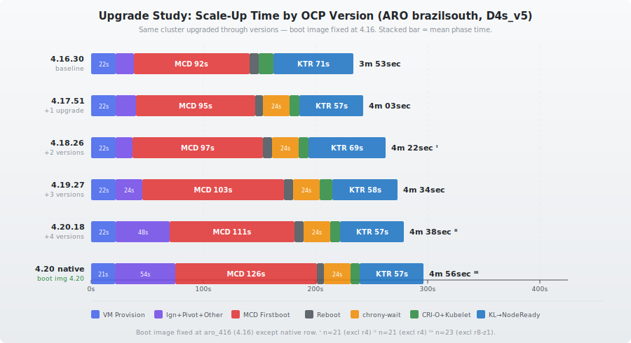

# Node Scale-Up Timing: ARO Upgrade Study (4.16 → 4.20)

## Purpose

Measure how node scale-up times change as a cluster is upgraded through successive OCP versions **without refreshing the boot image**. Each upgrade increases the delta between the boot image baked into the VM and the target OS image, potentially making the MCD firstboot rpm-ostree rebase slower.

## Test Setup

- **Cloud**: Microsoft Azure
- **Platform**: ARO (Azure Red Hat OpenShift) — managed OpenShift
  - 4.16–4.17: cluster `sdodsonbr2-28vkh`
  - 4.18+: cluster `sdodosnbr-znvt2` (original cluster lost during 4.18 upgrade; new cluster provisioned at 4.18.26 with boot image overridden to `aro_416`)
- **Region**: brazilsouth
- **Availability Zones**: 1, 2, 3 (one node per zone per round)
- **Instance Type**: Standard_D4s_v5 (4 vCPU, 16 GB RAM, Premium SSD)
- **OS Disk**: 128 GB Premium SSD (default ARO worker config)
- **Rounds per version**: 8 (3 zones per round, machinesets created simultaneously)
- **Samples per version**: 24 (8 rounds × 3 zones)
- **Date started**: 2026-04-23
- **IDMS**: `image-digest-mirror` active — all image pulls via `arosvc.azurecr.io` (quay.io blocked from ARO network)

## Upgrade Path

| Step | Version | VM Boot Image | Status |
|------|---------|---------------|--------|
| 1 | 4.16.30 | `aro4/aro_416/416.94.20241021` | **Complete** |
| 2 | 4.17.51 | `aro4/aro_416/416.94.20241021` | **Complete** |
| 3 | 4.18.26 | `aro4/aro_416/416.94.20241021` | **Complete** (new cluster, boot image overridden to 4.16) |
| 4 | 4.19.27 | `aro4/aro_416/416.94.20241021` | **Complete** |
| 5 | 4.20.18 | `aro4/aro_416/416.94.20241021` | **Complete** |
| 5b | 4.20.18 (native) | `aro4/420-v2/9.6.20251015` | **Complete** (boot image updated to 4.20) |

VM boot images come from Azure Marketplace publisher `azureopenshift`. **The boot image SKU stays at `aro_416` after upgrading to 4.17** — confirming that upgrades do not refresh the boot image.

## Phase Comparison

## Summary

| Version | Total (mean) | Stdev | Boot 1 | KTR | VM Prov | chrony-wait | systemd-analyze | n |
|---------|-------------|-------|--------|-----|---------|-------------|-----------------|---|
| **4.16.30** | **233s (3m 53sec)** | 21s | 119s | 84s | 22s | — | 13.3s | 24 |
| **4.17.51** | **243s (4m 03sec)** | 12s | 124s | 90s | 22s | 24.1s | 32.7s | 24 |
| **4.18.26** | **262s (4m 22sec)** ⁱ | 11s | 131s | 102s | 22s | 24.1s | 32.9s | 21 ⁱ |
| **4.19.27** | **274s (4m 34sec)** | 20s | 150s | 93s | 22s | 24.1s | 35.2s | 24 |
| **4.20.18** | **278s (4m 38sec)** ⁱⁱ | 17s | 159s | 90s | 22s | 24.1s | 33.4s | 21 ⁱⁱ |
| **4.20.18 (native)** | **296s (4m 56sec)** ⁱⁱⁱ | 26s | 180s | 89s | 21s | 24.1s | 32.2s | 23 ⁱⁱⁱ |

ⁱ 4.18.26 excludes round 4 outlier (3 samples). With all 24: mean 282s, stdev 54s. Round 4 had MCD 2–2.5× slower due to transient registry/network slowdown.

ⁱⁱ 4.20.18 excludes round 4 outlier (3 samples). With all 24: mean 293s, stdev 42s. Round 4 had MCD 2× slower due to transient registry/network slowdown.

ⁱⁱⁱ 4.20.18 (native) excludes r8-z1 outlier (1 sample). With all 24: mean 308s, stdev 65s. r8-z1 had boot1 457s due to Ignition/pivot stall. **Caution**: The native test ran sequentially after the override test on the same evening. Layer sharing analysis shows both boot images fetch nearly identical data (~1.5 GB, 50-51 ostree chunks with matching hashes), so the +18s vs override is likely registry throughput variance, not a boot-image effect. See "Layer Sharing Analysis" in the native section.

## OCP 4.16.30 — Baseline (Fresh Install)

### All Data Points

| Round | Zone | Total | VM Prov | Boot 1 | Reboot | KTR | systemd-analyze | chrony-wait |
|------:|-----:|------:|--------:|-------:|-------:|----:|----------------:|------------:|
| 1 | 1 | 279s | 22s | 163s | 5s | 89s | 13.0s | — |
| 1 | 2 | 278s | 23s | 147s | 6s | 102s | 12.6s | — |
| 1 | 3 | 276s | 21s | 175s | 9s | 71s | 13.2s | — |
| 2 | 1 | 225s | 21s | 124s | 6s | 74s | 12.7s | — |
| 2 | 2 | 223s | 21s | 114s | 6s | 82s | 13.3s | — |
| 2 | 3 | 224s | 21s | 122s | 9s | 72s | 13.1s | — |
| 3 | 1 | 206s | 22s | 104s | 9s | 71s | 12.8s | — |
| 3 | 2 | 205s | 22s | 102s | 10s | 71s | 13.4s | — |
| 3 | 3 | 204s | 22s | 112s | 6s | 64s | 13.0s | — |
| 4 | 1 | 239s | 20s | 127s | 8s | 84s | 13.1s | — |
| 4 | 2 | 237s | 21s | 122s | 7s | 87s | 13.9s | — |
| 4 | 3 | 235s | 20s | 106s | 7s | 102s | 12.9s | — |
| 5 | 1 | 227s | 22s | 113s | 9s | 83s | 16.7s | — |
| 5 | 2 | 226s | 24s | 120s | 7s | 75s | 13.0s | — |
| 5 | 3 | 224s | 20s | 115s | 6s | 83s | 13.0s | — |
| 6 | 1 | 241s | 26s | 120s | 9s | 86s | 14.3s | — |
| 6 | 2 | 237s | 23s | 96s | 9s | 109s | 13.4s | — |
| 6 | 3 | 235s | 32s | 96s | 9s | 98s | 13.1s | — |
| 7 | 1 | 219s | 22s | 105s | 6s | 86s | 12.9s | — |
| 7 | 2 | 217s | 22s | 113s | 10s | 72s | 13.8s | — |
| 7 | 3 | 216s | 21s | 107s | 6s | 82s | 12.8s | — |
| 8 | 1 | 238s | 25s | 135s | 9s | 69s | 12.3s | — |
| 8 | 2 | 235s | 23s | 97s | 9s | 106s | 13.0s | — |
| 8 | 3 | 233s | 21s | 113s | 8s | 91s | 13.7s | — |

### Statistics (n=24)

| Metric | Mean | Stdev | Min | Max |
|:---|---:|---:|---:|---:|
| **Total Scale-up** | **232.5s** | 20.5s | 204s | 279s |
| VM Provisioning | 22.4s | 2.5s | 20s | 32s |
| Boot 1 Duration | 118.7s | 19.8s | 96s | 175s |
| Reboot Gap | 7.7s | 1.5s | 5s | 10s |
| KTR | 83.7s | 12.6s | 64s | 109s |
| systemd-analyze | 13.3s | 0.8s | 12.3s | 16.7s |
| chrony-wait | — | — | — | — |

### Notes

- **No chrony-wait.service on 4.16** — this service was added in a later OCP version. Saves ~24s compared to 4.20+.
- **systemd-analyze is ~13s** vs ~32s on 4.20 — boot 2 is 19s faster without chrony-wait blocking the boot.
- Round 1 is an outlier (276-279s) likely due to cold registry caches. Rounds 2-8 are tighter (204-241s).

## OCP 4.17.51 — After First Upgrade

### All Data Points

| Round | Zone | Total | VM Prov | Boot 1 | Reboot | KTR | systemd-analyze | chrony-wait |
|------:|-----:|------:|--------:|-------:|-------:|----:|----------------:|------------:|
| 1 | 1 | 237s | 23s | 119s | 5s | 90s | 32.0s | 24.06s |
| 1 | 2 | 238s | 24s | 121s | 9s | 84s | 32.9s | 24.07s |
| 1 | 3 | 235s | 22s | 121s | 5s | 87s | 32.9s | 24.07s |
| 2 | 1 | 265s | 21s | 140s | 7s | 97s | 32.3s | 24.08s |
| 2 | 2 | 269s | 22s | 149s | 8s | 90s | 33.0s | 24.06s |
| 2 | 3 | 261s | 20s | 138s | 7s | 96s | 32.9s | 24.07s |
| 3 | 1 | 260s | 21s | 114s | 8s | 117s | 32.4s | 24.08s |
| 3 | 2 | 260s | 22s | 133s | 7s | 98s | 32.9s | 24.09s |
| 3 | 3 | 258s | 22s | 136s | 9s | 91s | 33.2s | 24.06s |
| 4 | 1 | 230s | 22s | 118s | 5s | 85s | 32.3s | 24.08s |
| 4 | 2 | 229s | 22s | 117s | 7s | 83s | 33.1s | 24.06s |
| 4 | 3 | 228s | 21s | 119s | 9s | 79s | 32.4s | 24.07s |
| 5 | 1 | 234s | 22s | 114s | 9s | 89s | 32.1s | 24.08s |
| 5 | 2 | 233s | 22s | 119s | 5s | 87s | 32.9s | 24.08s |
| 5 | 3 | 231s | 21s | 119s | 6s | 85s | 32.8s | 24.07s |
| 6 | 1 | 240s | 22s | 120s | 8s | 90s | 32.1s | 24.08s |
| 6 | 2 | 241s | 22s | 126s | 6s | 87s | 32.6s | 24.06s |
| 6 | 3 | 238s | 21s | 116s | 7s | 94s | 32.9s | 24.07s |
| 7 | 1 | 249s | 23s | 134s | 6s | 86s | 33.0s | 24.09s |
| 7 | 2 | 246s | 22s | 120s | 9s | 95s | 32.8s | 24.07s |
| 7 | 3 | 245s | 22s | 130s | 9s | 84s | 32.3s | 24.08s |
| 8 | 1 | 238s | 24s | 130s | 9s | 75s | 32.9s | 24.06s |
| 8 | 2 | 236s | 21s | 115s | 6s | 94s | 32.4s | 24.06s |
| 8 | 3 | 235s | 22s | 115s | 6s | 92s | 33.3s | 24.08s |

### Statistics (n=24)

| Metric | Mean | Stdev | Min | Max |
|:---|---:|---:|---:|---:|
| **Total Scale-up** | **243.2s** | 12.4s | 228s | 269s |
| VM Provisioning | 21.9s | 0.9s | 20s | 24s |
| Boot 1 Duration | 124.3s | 9.6s | 114s | 149s |
| Reboot Gap | 7.2s | 1.5s | 5s | 9s |
| KTR | 89.8s | 8.1s | 75s | 117s |
| systemd-analyze | 32.7s | 0.4s | 32.0s | 33.3s |
| chrony-wait | 24.07s | 0.01s | 24.06s | 24.09s |

### Boot 1 Sub-Phase Breakdown (from journal analysis)

| Phase | Mean | Stdev |
|-------|------|-------|
| Ignition + Pivot | 18s | 5s |
| MCD firstboot (rpm-ostree rebase) | 95s | 9s |
| Other (kernel boot, shutdown) | 11s | — |

### Changes from 4.16.30

| Phase | 4.16.30 | 4.17.51 | Delta |
|-------|---------|---------|-------|
| **Total** | **233s** | **243s** | **+10s** |
| Boot 1 | 119s | 124s | +5s |
| MCD firstboot | 92s | 95s | +3s |
| KTR | 84s | 90s | +6s |
| chrony-wait | — | 24.1s | **+24s (NEW)** |
| systemd-analyze | 13.3s | 32.7s | +19.4s |
| VM Provisioning | 22s | 22s | flat |

### Notes

- **chrony-wait.service appeared in 4.17** — adds a fixed 24.07s to boot 2. This is the single largest new cost, but it's offset by KTR being faster (KTR includes systemd boot time, so the net KTR increase is only +6s despite chrony adding 24s — kubelet-to-NodeReady itself is faster).
- **Boot image stays at `aro_416`** — confirmed. The SKU did not change after upgrade.
- **MCD firstboot grew only +3s** (92s → 95s) — the boot image drift from 4.16→4.17 has minimal impact on rpm-ostree rebase time.
- **Lower variance than 4.16** — stdev dropped from 21s to 12s.

## OCP 4.18.26 — Two Version Steps from Boot Image

**Note**: Original cluster was lost during 4.18 upgrade. New cluster provisioned at 4.18.26 with boot image manually overridden to `aro_416/416.94.20241021` in machinesets. Cluster: `sdodosnbr-znvt2`.

### All Data Points

| Round | Zone | Total | VM Prov | Boot 1 | Reboot | KTR | systemd-analyze | chrony-wait |
|------:|-----:|------:|--------:|-------:|-------:|----:|----------------:|------------:|
| 1 | 1 | 267s | 23s | 119s | 9s | 116s | 32.5s | 24.1s |
| 1 | 2 | 266s | 23s | 148s | 7s | 88s | 32.9s | 24.1s |
| 1 | 3 | 265s | 22s | 152s | 9s | 82s | 32.8s | 24.1s |
| 2 | 1 | 260s | 24s | 138s | 8s | 90s | 32.3s | 24.1s |
| 2 | 2 | 260s | 25s | 123s | 9s | 103s | 32.9s | 24.1s |
| 2 | 3 | 254s | 23s | 126s | 9s | 96s | 33.0s | 24.1s |
| 3 | 1 | 267s | 21s | 140s | 9s | 97s | 33.1s | 24.1s |
| 3 | 2 | 265s | 22s | 127s | 10s | 106s | 33.0s | 24.1s |
| 3 | 3 | 263s | 20s | 130s | 9s | 104s | 32.6s | 24.1s |
| **4** | **1** | **420s** | **22s** | **258s** | **7s** | **133s** | **32.8s** | **24.1s** |
| **4** | **2** | **417s** | **23s** | **271s** | **10s** | **113s** | **33.0s** | **24.1s** |
| **4** | **3** | **417s** | **23s** | **265s** | **9s** | **120s** | **32.6s** | **24.1s** |
| 5 | 1 | 260s | 21s | 136s | 6s | 97s | 33.2s | 24.1s |
| 5 | 2 | 258s | 22s | 116s | 7s | 113s | 32.8s | 24.1s |
| 5 | 3 | 257s | 22s | 135s | 9s | 91s | 32.5s | 24.1s |
| 6 | 1 | 244s | 21s | 117s | 10s | 96s | 32.7s | 24.1s |
| 6 | 2 | 243s | 21s | 135s | 8s | 79s | 32.9s | 24.1s |
| 6 | 3 | 241s | 21s | 124s | 6s | 90s | 32.5s | 24.1s |
| 7 | 1 | 284s | 22s | 132s | 7s | 123s | 34.8s | 24.1s |
| 7 | 2 | 281s | 21s | 132s | 8s | 120s | 32.5s | 24.1s |
| 7 | 3 | 282s | 21s | 151s | 10s | 100s | 33.6s | 24.1s |
| 8 | 1 | 264s | 21s | 113s | 5s | 125s | 32.2s | 24.1s |
| 8 | 2 | 265s | 22s | 128s | 6s | 109s | 33.3s | 24.1s |
| 8 | 3 | 261s | 24s | 120s | 10s | 107s | 33.5s | 24.1s |

### Statistics (n=21, excluding round 4 outlier)

| Metric | Mean | Stdev | Min | Max |
|:---|---:|---:|---:|---:|
| **Total Scale-up** | **262.2s** | 11.4s | 241s | 284s |
| VM Provisioning | 22.0s | 1.3s | 20s | 25s |
| Boot 1 Duration | 130.6s | 11.2s | 113s | 152s |
| Reboot Gap | 8.1s | 1.5s | 5s | 10s |
| KTR | 101.5s | 13.0s | 79s | 125s |
| systemd-analyze | 32.9s | 0.6s | 32.2s | 34.8s |
| chrony-wait | 24.1s | 0.0s | 24.1s | 24.1s |

### Statistics (all n=24, including round 4 outlier)

| Metric | Mean | Stdev | Min | Max |
|:---|---:|---:|---:|---:|
| **Total Scale-up** | **281.7s** | 53.7s | 241s | 420s |
| Boot 1 Duration | 147.3s | 46.5s | 113s | 271s |
| KTR | 104.1s | 14.2s | 79s | 133s |

### Boot 1 Sub-Phase Breakdown

| Phase | Mean (excl. r4) | Mean (all 24) | Stdev |
|-------|---:|---:|---:|
| Ignition + Pivot | 15s | 15s | 5s |
| MCD firstboot (rpm-ostree rebase) | 97s | 114s | 45s |
| Other (kernel boot, shutdown) | 19s | 19s | 2s |

### Changes from 4.17.51

| Phase | 4.17.51 | 4.18.26 (excl. r4) | Delta |
|-------|---------|---------------------|-------|
| **Total** | **243s** | **262s** | **+19s** |
| Boot 1 | 124s | 131s | +7s |
| MCD firstboot | 95s | 97s | +2s |
| KTR | 90s | 102s | +12s |
| chrony-wait | 24.1s | 24.1s | flat |
| systemd-analyze | 32.7s | 32.9s | flat |
| VM Provisioning | 22s | 22s | flat |

### Notes

- **MCD firstboot grew only +2s** (95s → 97s) — even with two version steps of boot image drift (4.16 → 4.18), rpm-ostree rebase time barely increased. Cumulative drift from baseline: +5s (92s → 97s).
- **KTR increased +12s** (90s → 102s) — this is the largest phase increase. Since systemd-analyze and chrony-wait are flat, the extra time is in kubelet-to-NodeReady (CSR approval, CNI image pulls). Image size analysis below explains this growth.
- **Round 4 outlier**: All 3 zones had MCD 220-240s (2–2.5× normal). Consistent with transient registry/network slowdown — not boot image drift.
- **Boot image confirmed as `aro_416/416.94.20241021`** — manually overridden in machinesets on the 4.18.26 cluster.

## Container Image Size Analysis (KTR Growth)

The same 28 images and 15 DaemonSet pods are present on every worker node across all three versions — no new blocking workloads were added. However, total image payload has grown significantly:

| Metric | 4.16.30 | 4.17.51 | 4.18.26 | Delta |
|--------|---------|---------|---------|-------|
| Image count | 28 | 28 | 28 | +0 |
| Total size | 14.3 GB | 15.7 GB | 16.2 GB | +1.9 GB (+13%) |
| Largest image (ovn-k) | 1331 MB | 1423 MB | 1669 MB | +338 MB (+25%) |
| Images > 800 MB | 2 | 4 | 5 | +3 |

### Critical-Path Blocking Pulls (r1-z1)

| Blocking Pod | 4.16 pull | 4.17 pull | 4.18 pull |
|---|---|---|---|
| multus-additional-cni-plugins | 52s | 46s | 56s |
| multus | 31s | 24s | 35s |
| ovnkube-node | 33s | 24s | 32s |
| machine-config-daemon | 13s | 0s | 35s |
| node-resolver | 10s | 24s | 27s |

multus-additional-cni-plugins is consistently the critical-path bottleneck at ~56s.

**Conclusion**: KTR growth (84s → 102s) is driven by image size growth (+13%) and boot image drift reducing container layer sharing — not by new workloads.

## OCP 4.19.27 — Three Version Steps from Boot Image

### All Data Points

| Round | Zone | Total | VM Prov | Boot 1 | Reboot | KTR | systemd-analyze | chrony-wait |
|------:|-----:|------:|--------:|-------:|-------:|----:|----------------:|------------:|
| 1 | 1 | 253s | 21s | 131s | 6s | 95s | 35.6s | 24.1s |
| 1 | 2 | 282s | 21s | 165s | 9s | 87s | 34.9s | 24.1s |
| 1 | 3 | 279s | 21s | 161s | 8s | 89s | 36.3s | 24.1s |
| 2 | 1 | 294s | 21s | 165s | 6s | 102s | 34.9s | 24.1s |
| 2 | 2 | 247s | 24s | 129s | 9s | 85s | 35.7s | 24.1s |
| 2 | 3 | 284s | 28s | 153s | 10s | 93s | 36.1s | 24.1s |
| 3 | 1 | 255s | 21s | 138s | 8s | 88s | 34.3s | 24.1s |
| 3 | 2 | 249s | 22s | 138s | 9s | 80s | 34.3s | 24.1s |
| 3 | 3 | 268s | 22s | 151s | 6s | 89s | 35.8s | 24.1s |
| 4 | 1 | 249s | 22s | 136s | 6s | 85s | 35.2s | 24.1s |
| 4 | 2 | 269s | 23s | 133s | 7s | 106s | 34.7s | 24.1s |
| 4 | 3 | 265s | 22s | 141s | 6s | 96s | 35.5s | 24.1s |
| 5 | 1 | 256s | 21s | 134s | 6s | 95s | 35.3s | 24.1s |
| 5 | 2 | 286s | 23s | 147s | 8s | 108s | 35.3s | 24.1s |
| 5 | 3 | 255s | 23s | 136s | 7s | 89s | 35.6s | 24.1s |
| 6 | 1 | 252s | 23s | 125s | 8s | 96s | 35.2s | 24.1s |
| 6 | 2 | 274s | 22s | 133s | 7s | 112s | 34.9s | 24.1s |
| 6 | 3 | 262s | 23s | 135s | 9s | 95s | 35.7s | 24.1s |
| 7 | 1 | 316s | 22s | 181s | 6s | 107s | 35.6s | 24.1s |
| 7 | 2 | 305s | 23s | 177s | 7s | 98s | 35.4s | 24.1s |
| 7 | 3 | 299s | 20s | 175s | 11s | 93s | 34.8s | 24.1s |
| 8 | 1 | 289s | 22s | 177s | 9s | 81s | 34.6s | 24.1s |
| 8 | 2 | 297s | 21s | 182s | 8s | 86s | 34.3s | 24.1s |
| 8 | 3 | 281s | 21s | 165s | 8s | 87s | 35.2s | 24.1s |

### Statistics (n=24)

| Metric | Mean | Stdev | Min | Max |
|:---|---:|---:|---:|---:|
| **Total Scale-up** | **273.6s** | 19.9s | 247s | 316s |
| VM Provisioning | 22.2s | 1.6s | 20s | 28s |
| Boot 1 Duration | 150.3s | 18.8s | 125s | 182s |
| Reboot Gap | 7.7s | 1.4s | 6s | 11s |
| KTR | 93.4s | 8.6s | 80s | 112s |
| systemd-analyze | 35.2s | 0.5s | 34.3s | 36.3s |
| chrony-wait | 24.1s | 0.0s | 24.1s | 24.1s |

### Boot 1 Sub-Phase Breakdown

| Phase | Mean | Stdev |
|-------|------|-------|
| Ignition + Pivot | 24s | 4s |
| MCD firstboot (rpm-ostree rebase) | 103s | 18s |
| Other (kernel boot, image pull, shutdown) | 23s | 2s |

### Changes from 4.18.26

| Phase | 4.18.26 (excl. r4) | 4.19.27 | Delta |
|-------|---------------------|---------|-------|
| **Total** | **262s** | **274s** | **+12s** |
| Boot 1 | 131s | 150s | +19s |
| MCD firstboot | 97s | 103s | +6s |
| Ignition+Pivot | 15s | 24s | +9s |
| KTR | 102s | 93s | -9s |
| chrony-wait | 24.1s | 24.1s | flat |
| systemd-analyze | 32.9s | 35.2s | +2.3s |
| VM Provisioning | 22s | 22s | flat |

### Cumulative Drift from Baseline (4.16.30)

| Phase | 4.16.30 | 4.19.27 | Cumulative Delta |
|-------|---------|---------|------------------|
| **Total** | **233s** | **274s** | **+41s (+18%)** |
| Boot 1 | 119s | 150s | +31s (+26%) |
| MCD firstboot | 92s | 103s | +11s (+12%) |
| Ignition+Pivot | — | 24s | — |
| KTR | 84s | 93s | +9s (+11%) |
| systemd-analyze | 13.3s | 35.2s | +21.9s |

### Notes

- **MCD firstboot grew +6s** (97s → 103s) — the largest single-step increase so far. Cumulative drift from baseline: +11s (92s → 103s, +12%). Boot image drift is now measurable but still modest.
- **Ignition+Pivot grew +9s** (15s → 24s) — a significant increase, possibly due to larger Ignition configs or pivot overhead with greater version distance.
- **KTR dropped -9s** (102s → 93s) — this reversal from the 4.18 trend may reflect warmed caches on this cluster vs the fresh 4.18 cluster. systemd-analyze grew +2.3s, so kubelet-to-NodeReady (KTR minus systemd) improved by ~11s.
- **systemd-analyze grew +2.3s** (32.9s → 35.2s) — first notable increase since 4.17. chrony-wait is unchanged at 24.1s, so the additional time is in other boot 2 services.
- **Rounds 7-8 had higher Boot 1** (~175-182s vs ~125-165s) — MCD firstboot was 129-133s in these rounds, suggesting possible registry contention in later rounds.
- **Boot image confirmed as `aro_416/416.94.20241021`** — overridden in machinesets.

## OCP 4.20.18 — Four Version Steps from Boot Image

### All Data Points

| Round | Zone | Total | VM Prov | Boot 1 | Reboot | KTR | systemd-analyze | chrony-wait |
|------:|-----:|------:|--------:|-------:|-------:|----:|----------------:|------------:|
| 1 | 1 | 267s | 22s | 147s | 6s | 92s | 33.4s | 24.1s |
| 1 | 2 | 319s | 21s | 169s | 13s | 116s | 34.9s | 24.1s |
| 1 | 3 | 281s | 22s | 166s | 7s | 86s | 33.3s | 24.1s |
| 2 | 1 | 251s | 22s | 140s | 7s | 82s | 32.8s | 24.1s |
| 2 | 2 | 268s | 24s | 147s | 9s | 88s | 33.5s | 24.1s |
| 2 | 3 | 297s | 21s | 176s | 5s | 95s | 34.5s | 24.1s |
| 3 | 1 | 280s | 22s | 164s | 8s | 86s | 32.8s | 24.1s |
| 3 | 2 | 279s | 23s | 161s | 7s | 88s | 33.3s | 24.1s |
| 3 | 3 | 281s | 20s | 165s | 7s | 89s | 33.3s | 24.1s |
| **4** | **1** | **394s** | **20s** | **254s** | **7s** | **113s** | **32.9s** | **24.1s** |
| **4** | **2** | **370s** | **22s** | **241s** | **6s** | **101s** | **33.0s** | **24.1s** |
| **4** | **3** | **411s** | **23s** | **276s** | **7s** | **105s** | **34.0s** | **24.1s** |
| 5 | 1 | 297s | 20s | 182s | 5s | 90s | 33.0s | 24.1s |
| 5 | 2 | 308s | 25s | 181s | 9s | 93s | 33.9s | 24.1s |
| 5 | 3 | 298s | 29s | 173s | 9s | 87s | 33.5s | 24.1s |
| 6 | 1 | 270s | 23s | 146s | 10s | 91s | 33.4s | 24.1s |
| 6 | 2 | 269s | 22s | 155s | 6s | 86s | 33.3s | 24.1s |
| 6 | 3 | 282s | 22s | 158s | 7s | 95s | 33.2s | 24.1s |
| 7 | 1 | 276s | 20s | 150s | 5s | 101s | 32.8s | 24.1s |
| 7 | 2 | 257s | 23s | 142s | 9s | 83s | 33.3s | 24.1s |
| 7 | 3 | 258s | 22s | 144s | 9s | 83s | 33.3s | 24.1s |
| 8 | 1 | 264s | 22s | 145s | 5s | 92s | 33.6s | 24.1s |
| 8 | 2 | 266s | 19s | 156s | 7s | 84s | 33.3s | 24.1s |
| 8 | 3 | 279s | 22s | 164s | 8s | 85s | 33.1s | 24.1s |

### Statistics (n=21, excluding round 4 outlier)

| Metric | Mean | Stdev | Min | Max |
|:---|---:|---:|---:|---:|
| **Total Scale-up** | **278.4s** | 17.3s | 251s | 319s |
| VM Provisioning | 22.2s | 2.1s | 19s | 29s |
| Boot 1 Duration | 158.6s | 13.0s | 140s | 182s |
| Reboot Gap | 7.5s | 2.0s | 5s | 13s |
| KTR | 90.1s | 7.6s | 82s | 116s |
| systemd-analyze | 33.4s | 0.5s | 32.8s | 34.9s |
| chrony-wait | 24.1s | 0.0s | 24.1s | 24.1s |

### Statistics (all n=24, including round 4 outlier)

| Metric | Mean | Stdev | Min | Max |
|:---|---:|---:|---:|---:|
| **Total Scale-up** | **292.6s** | 42.0s | 251s | 411s |
| Boot 1 Duration | 170.9s | 35.8s | 140s | 276s |
| KTR | 92.1s | 9.1s | 82s | 116s |

### Boot 1 Sub-Phase Breakdown

| Phase | Mean (excl. r4) | Mean (all 24) | Stdev |
|-------|---:|---:|---:|
| Ignition + Pivot | 37s | 38s | 4s |
| MCD firstboot (rpm-ostree rebase) | 111s | 122s | 33s |
| Other (kernel boot, shutdown) | 11s | 11s | 1s |

### Detailed Boot 1 Timeline (r3-z1 sample, Boot 1 = 164s)

Source: `node-journal-aro-upgrade-4-20-18-d4s-v5-r3-z1.log`

| # | Timestamp | Δ | Cumul. | Milestone |
|---|-----------|---|--------|-----------|
| 1 | 20:53:19 | — | 0s | First kernel message (5.14.0-427.42.1.el9_4, boot image kernel) |
| 2 | 20:53:21 | 2s | 2s | Ignition IMDS attempt #1 (network unreachable — DHCP not yet complete) |
| 3 | 20:53:28 | 7s | 9s | DHCP lease acquired (eth0, 10.0.2.135) |
| 4 | 20:53:33 | 5s | 14s | Ignition fetch succeeds (IMDS attempt #7, MCS config from 10.0.2.4:22623) |
| 5 | 20:53:36 | 3s | 17s | Ignition disks/grow/mount done (root partition 3 GB → 128 GB) |
| 6 | 20:53:37 | 1s | 18s | Ignition files written (~80 files/units in ~1s) |
| 7 | 20:53:38 | 1s | 19s | Initrd teardown (coreos-teardown-initramfs, flush routes) |
| 8 | 20:53:38 | 0s | 19s | Switch Root target reached |
| 9 | 20:53:39 | 1s | 20s | Real-root systemd init begins |
| 10 | 20:53:45 | 6s | 26s | CRI-O starts (1.29.9); machine-config-daemon-pull.service starts |
| 11 | 20:53:59 | 14s | 40s | MCD image pull complete (podman pull MCD container, ~14s) |
| 12 | 20:54:00 | 1s | 41s | machine-config-daemon-firstboot.service starts; detects osUpdate+kargs changes |
| 13 | 20:54:19 | 19s | 60s | Extensions image pull complete (node-image-extensions container, ~19s) |
| 14 | 20:54:29 | 10s | 70s | Extensions content extracted (podman cp + chcon relabeling, ~10s) |
| 15 | 20:54:29 | 0s | 70s | rpm-ostree cleanup; rebase initiated |
| 16 | 20:54:31 | 2s | 72s | Layer fetching begins (51 ostree chunks, 1.3 GB + 2 custom layers, 193 MB) |
| 17 | 20:54:43 | 12s | 84s | Base ostree chunk fetched (sha256:831efff, 623 MB @ ~52 MB/s) |
| 18 | 20:55:28 | 45s | 129s | All 51 ostree chunks fetched (remaining 50 chunks, ~700 MB in 45s) |
| 19 | 20:55:41 | 13s | 142s | Custom layers fetched (sha256:d9d9e2, 192.9 MB @ ~15 MB/s) |
| 20 | 20:55:46 | 5s | 147s | Staging deployment done (ostree checkout + SELinux relabeling) |
| 21 | 20:55:47 | 1s | 148s | Txn Rebase successful; RPM diff printed |
| 22 | 20:55:49 | 2s | 150s | kargs redeployment starts (cgroup_no_v1, psi=0, unified_cgroup_hierarchy) |
| 23 | 20:55:51 | 2s | 152s | kargs deployment done |
| 24 | 20:55:52 | 1s | 153s | MCD: "Rebooting node" — systemd reboot initiated |
| 25 | 20:56:03 | 11s | 164s | ostree-finalize-staged complete (2.1s CPU); last boot 1 messages |
| 26 | 20:56:11 | 8s | — | Boot 2 kernel starts (5.14.0-570.104.1.el9_6 — rebased kernel) |

### Detailed Boot 1 Comparison: 4.19 vs 4.20 (r3-z1 samples)

Compared against `node-journal-aro-upgrade-4-19-27-d4s-v5-r3-z1.log` (Boot 1 = 138s).

| Sub-Phase | 4.19 r3-z1 | 4.20 r3-z1 | Delta | Notes |
|-----------|------------|------------|-------|-------|
| Kernel + initrd + dracut | 3s | 2s | -1s | Same kernel (5.14.0-427.42.1) |
| Ignition IMDS retries | 6s (6 att.) | 12s (7 att.) | **+6s** | Extra retry due to DHCP/IMDS race |
| Ignition disks/grow/mount | 3s | 3s | flat | |
| Ignition files | 1s | 1s | flat | |
| Teardown + switch-root | 2s | 2s | flat | |
| Real-root systemd init | 5s | 6s | +1s | |
| **Ignition+Pivot subtotal** | **20s** | **26s** | **+6s** | |
| MCD image pull | 11s | 14s | +3s | Larger MCD container for 4.20 |
| Extensions pull | 17s | 19s | +2s | node-image-extensions container |
| Extensions copy + relabel | 7s | 10s | +3s | podman cp + chcon |
| rpm-ostree layer fetch | 59s | 70s | **+11s** | 51 chunks + 2 layers; see below |
| rpm-ostree staging | 5s | 5s | flat | Checkout + SELinux relabel |
| kargs redeployment | 4s | 5s | +1s | |
| MCD → reboot trigger | 1s | 1s | flat | |
| **MCD total (pull+firstboot)** | **104s** | **127s** | **+23s** | |
| Shutdown + ostree-finalize | 10s | 11s | +1s | ostree-finalize: ~2.1s CPU each |
| **Total Boot 1** | **138s** | **164s** | **+26s** | |
| Reboot gap (POST+bootloader) | 8s | 8s | flat | |

**Where the +26s grew**:

1. **rpm-ostree layer fetch (+11s)** — the largest single contributor. Both versions fetch 51 ostree chunks (~1.3 GB) plus 2 custom layers. The base ostree chunk (sha256:831efff, 623 MB) is identical across versions. The custom layer grew slightly (187.4 → 192.9 MB, +3%). Most of the +11s appears to be network throughput variance rather than content growth — the ostree chunks took 47s (4.19) vs 57s (4.20) despite having the same count and similar total size.
2. **Ignition IMDS retries (+6s)** — 4.19 succeeded on IMDS attempt #6 immediately after DHCP, while 4.20 needed attempt #7 (exponential backoff adds ~5s per extra retry). This is a DHCP/IMDS timing race, not a version-dependent change.
3. **Extensions pull+copy (+5s)** — the node-image-extensions container pull took 2s longer and content extraction (podman cp + chcon) took 3s longer, consistent with slightly larger extension content in 4.20.
4. **MCD image pull (+3s)** — the MCO container image is larger in 4.20.

**What did NOT grow**: rpm-ostree deployment staging (5s both versions), Ignition files (1s), switch-root (2s), ostree-finalize (2.1s CPU), reboot gap (8s).

### Changes from 4.19.27

| Phase | 4.19.27 | 4.20.18 (excl. r4) | Delta |
|-------|---------|---------------------|-------|
| **Total** | **274s** | **278s** | **+4s** |
| Boot 1 | 150s | 159s | +9s |
| MCD firstboot | 103s | 111s | +8s |
| KTR | 93s | 90s | -3s |
| chrony-wait | 24.1s | 24.1s | flat |
| systemd-analyze | 35.2s | 33.4s | -1.8s |
| VM Provisioning | 22s | 22s | flat |

### Cumulative Drift from Baseline (4.16.30)

| Phase | 4.16.30 | 4.20.18 | Cumulative Delta |
|-------|---------|---------|------------------|
| **Total** | **233s** | **278s** | **+45s (+19%)** |
| Boot 1 | 119s | 159s | +40s (+34%) |
| MCD firstboot | 92s | 111s | +19s (+21%) |
| KTR | 84s | 90s | +6s (+7%) |
| systemd-analyze | 13.3s | 33.4s | +20.1s |

### Notes

- **MCD firstboot grew +8s** (103s → 111s) — largest single-step MCD increase. Cumulative drift from baseline: +19s (92s → 111s, +21%). Four version steps of boot image drift now adds ~19s to MCD.
- **KTR dropped -3s** (93s → 90s) — continuing the improvement from 4.19. systemd-analyze dropped -1.8s (35.2s → 33.4s), accounting for most of the KTR improvement.
- **Round 4 outlier**: All 3 zones had MCD 194-208s (2× normal), consistent with transient registry/network slowdown — same pattern as 4.18 round 4.
- **Boot image confirmed as `aro_416/416.94.20241021`** — overridden in machinesets.
- **Total growth is flattening**: +45s cumulative over 4 version steps, but only +4s in the latest step (4.19 → 4.20). MCD grows ~5-8s per step while KTR has stabilized.
- **Detailed journal analysis** (r3-z1 sample) shows the Boot 1 growth is spread across rpm-ostree layer fetch (+11s, mostly throughput variance), Ignition IMDS retry jitter (+6s), and extensions image pull/copy (+5s). Deployment staging and ostree-finalize are stable at 5s and 2.1s CPU respectively.

## OCP 4.20.18 (Native Boot Image) — After Boot Image Update

After completing the 4.20.18 override tests, machinesets were updated to use the native `aro4/420-v2/9.6.20251015` boot image (a 4.20-era image). This eliminates the 4-version boot image drift and tests whether refreshing the boot image reduces scale-up time. **Result**: it does not — layer sharing analysis shows the native boot image shares only 1 of 51 ostree chunks (2.3 kB) with the 4.20.18 target, so rpm-ostree must fetch the same ~1.5 GB regardless of boot image. See "Layer Sharing Analysis" below.

### All Data Points

| Round | Zone | Total | VM Prov | Boot 1 | Reboot | KTR | systemd-analyze | chrony-wait |
|------:|-----:|------:|--------:|-------:|-------:|----:|----------------:|------------:|
| 1 | 1 | 304s | 20s | 191s | 4s | 89s | 31.9s | 24.1s |
| 1 | 2 | 252s | 20s | 139s | 4s | 89s | 31.5s | 24.1s |
| 1 | 3 | 311s | 20s | 196s | 10s | 85s | 32.5s | 24.1s |
| 2 | 1 | 292s | 21s | 180s | 5s | 86s | 32.4s | 24.1s |
| 2 | 2 | 258s | 21s | 142s | 6s | 89s | 32.2s | 24.1s |
| 2 | 3 | 250s | 20s | 139s | 5s | 86s | 32.2s | 24.1s |
| 3 | 1 | 290s | 22s | 183s | 7s | 78s | 32.2s | 24.1s |
| 3 | 2 | 273s | 19s | 156s | 5s | 93s | 31.8s | 24.1s |
| 3 | 3 | 309s | 26s | 182s | 5s | 96s | 32.6s | 24.1s |
| 4 | 1 | 327s | 21s | 217s | 7s | 82s | 32.1s | 24.1s |
| 4 | 2 | 320s | 21s | 205s | 7s | 87s | 32.0s | 24.1s |
| 4 | 3 | 332s | 19s | 210s | 7s | 96s | 32.3s | 24.1s |
| 5 | 1 | 326s | 21s | 202s | 3s | 100s | 31.9s | 24.1s |
| 5 | 2 | 329s | 21s | 207s | 6s | 95s | 31.4s | 24.1s |
| 5 | 3 | 324s | 22s | 207s | 6s | 89s | 32.5s | 24.1s |
| 6 | 1 | 304s | 19s | 179s | 5s | 101s | 32.5s | 24.1s |
| 6 | 2 | 248s | 20s | 130s | 8s | 90s | 31.8s | 24.1s |
| 6 | 3 | 291s | 20s | 178s | 7s | 86s | 33.1s | 24.1s |
| 7 | 1 | 293s | 21s | 179s | 8s | 85s | 33.0s | 24.1s |
| 7 | 2 | 285s | 22s | 172s | 5s | 86s | 32.2s | 24.1s |
| 7 | 3 | 296s | 19s | 189s | 4s | 84s | 32.0s | 24.1s |
| **8** | **1** | **587s** | **35s** | **457s** | **5s** | **90s** | **31.9s** | **24.1s** |
| 8 | 2 | 283s | 19s | 168s | 4s | 92s | 32.0s | 24.1s |
| 8 | 3 | 300s | 21s | 184s | 7s | 88s | 33.0s | 24.1s |

### Statistics (n=23, excluding r8-z1 outlier)

| Metric | Mean | Stdev | Min | Max |
|:---|---:|---:|---:|---:|
| **Total Scale-up** | **295.5s** | 26.0s | 248s | 332s |
| VM Provisioning | 20.7s | 1.5s | 19s | 26s |
| Boot 1 Duration | 179.8s | 24.7s | 130s | 217s |
| Reboot Gap | 5.9s | 1.7s | 3s | 10s |
| KTR | 89.2s | 5.6s | 78s | 101s |
| systemd-analyze | 32.2s | 0.4s | 31.4s | 33.1s |
| chrony-wait | 24.1s | 0.0s | 24.1s | 24.1s |

### Statistics (all n=24, including r8-z1 outlier)

| Metric | Mean | Stdev | Min | Max |
|:---|---:|---:|---:|---:|
| **Total Scale-up** | **307.7s** | 64.7s | 248s | 587s |
| Boot 1 Duration | 191.3s | 61.5s | 130s | 457s |
| KTR | 89.2s | 5.5s | 78s | 101s |

### Boot 1 Sub-Phase Breakdown (excl. r8-z1)

| Phase | Mean | Stdev |
|-------|---:|---:|
| Ignition + Pivot | 39s | 5s |
| MCD firstboot (rpm-ostree rebase) | 126s | 19s |
| Other (kernel boot, shutdown) | 15s | 6s |

### Comparison: Native vs Override (4.20.18)

| Phase | Override (excl. r4) | Native (excl. r8-z1) | Delta |
|-------|---------------------|----------------------|-------|
| **Total** | **278s** | **296s** | **+18s** |
| VM Provisioning | 22s | 21s | -1s |
| Boot 1 | 159s | 180s | +21s |
| Ignition + Pivot | 37s | 39s | +2s |
| MCD firstboot | 111s | 126s | +15s |
| Other (kernel, shutdown) | 11s | 15s | +4s |
| Reboot | 8s | 6s | -2s |
| KTR | 90s | 89s | -1s |
| systemd-analyze | 33.4s | 32.2s | -1.2s |
| chrony-wait | 24.1s | 24.1s | flat |

### MCD Sub-Phase Comparison (all clean samples)

| MCD Sub-Phase | Override (n=21) | Native (n=23) | Delta |
|---|---|---|---|
| Extensions pull+copy | 30.0s (σ=2.0) | 32.6s (σ=7.1) | +2.6s |
| rpm-ostree rebase | 74.0s (σ=11.3) | 85.0s (σ=14.6) | **+11.0s** |
| kargs+reboot | 4.8s (σ=0.5) | 6.3s (σ=1.3) | +1.5s |
| **Total MCD** | **108.8s** | **124.0s** | **+15.2s** |

### Layer Sharing Analysis: Why the Native Boot Image Doesn't Help

Journal analysis reveals that the 4.20 native boot image (`aro4/420-v2`) shares almost nothing with the 4.20.18 target OS image at the ostree layer level:

| Metric | Override (4.16 boot image) | Native (4.20 boot image) |
|--------|---------------------------|--------------------------|
| Ostree chunk layers needed | 51 | 50 |
| Ostree chunk layers already present | 0 | 1 |
| Shared layer | — | sha256:9dad063a624b (**2.3 kB**) |
| Custom layers needed | 2 (192.9 MB) | 2 (192.9 MB) |
| Total data fetched | ~1.5 GB | ~1.5 GB |

The 50 ostree chunks fetched by the native boot image have **identical hashes** to 50 of the 51 chunks fetched by the override. The single "shared" layer is 2.3 kB — effectively zero savings. Both boot images must fetch the same ~1.5 GB of OS content during rpm-ostree rebase.

This means the boot image version has **no meaningful effect on which layers need fetching or how much data is transferred**. The +15s MCD penalty seen with the native boot image is not caused by boot image drift or layer sharing — it is registry throughput variance from sequential testing.

### Ostree Layer/Chunk Comparison Across Versions and Platforms

The table below compares the ostree chunk layer composition at each upgrade step, plus the AWS 4.20.18 cluster used for optimization testing. All data extracted from `rpm-ostree` and `podman` journal lines during MCD firstboot.

| Version | Boot Image | Chunks Present | Chunks Needed | Custom Layers | Total Fetch |
|---------|------------|---------------:|--------------:|--------------:|------------:|
| **ARO 4.16.30** | aro_416 (native) | **14** | **37** | 0 | **945 MB** |
| **ARO 4.17.51** | aro_416 (stale) | **0** | **51** | 0 | **1.2 GB** |
| **ARO 4.18.26** | aro_416 (stale) | **0** | **51** | 0 | **1.2 GB** |
| **ARO 4.19.27** | aro_416 (stale) | **0** | **51** | 2 (187 MB) | **1.4 GB** |
| **ARO 4.20.18** | aro_416 (stale) | **0** | **51** | 2 (193 MB) | **1.4 GB** |
| **ARO 4.20.18 (native)** | aro_420 (refreshed) | **1** | **50** | 2 (193 MB) | **1.4 GB** |
| **AWS 4.20.18** | RHCOS AMI 4.20.17 | **26** | **25** | 2 (193 MB) | **613 MB** |
| **AWS 4.20.19** | RHCOS AMI 4.20.17 | **23** | **28** | 2 (193 MB) | **644 MB** |
| **AWS 4.20.20** | RHCOS AMI 4.20.17 | **18** | **33** | 2 (193 MB) | **702 MB** |

**Observations:**

- **ARO layer sharing collapsed after one upgrade.** The 4.16 boot image had 14 chunks in common with the 4.16 target; after upgrading to 4.17 that dropped to 0. Further upgrades to 4.18–4.20 stayed at 0 — there was nothing left to lose.
- **Refreshing the ARO boot image to 4.20 recovered only 1 chunk** (2.3 kB). The ARO marketplace image and the OCP machine-os image produce almost entirely different ostree chunk hashes even for the same OCP version.
- **The AWS RHCOS AMI (effectively 4.20.17) shares 26 of 51 chunks at 4.20.18**, including the largest single chunk (623 MB). This drops the ostree fetch from 1.3 GB to 420 MB — a 68% reduction in ostree data transferred. Layer sharing degrades measurably per z-stream: 26/51 at 4.20.18 (1 z-stream behind) → 23/51 at 4.20.19 (−3 chunks) → 18/51 at 4.20.20 (−5 more chunks). The fetch volume grows correspondingly: 613 → 644 → 702 MB. The custom layers (193 MB) are never cached on either platform.
- **4.19 introduced 2 ["custom layers"](ostree-chunk-vs-custom-layers.md)** (~190 MB) that are always fetched regardless of boot image. The ostree chunk count stayed at 51 across all versions; total layer count rose from 51 to 53 in 4.19+.
- **The largest single chunk grew over time**: 431 MB (4.16) → 461 MB (4.17–4.18) → 623 MB (4.19+). This chunk dominates fetch time and is present in the AWS boot image but absent from all ARO boot images.

### Rebase Apply Time: Fetch vs Apply Breakdown

Splitting the rpm-ostree rebase transaction into fetch (downloading chunks) and apply (unpacking into the ostree repo and staging the deployment) reveals that the number of chunks fetched has no meaningful effect on apply time. Apply time is dominated by the 2 [custom layers](ostree-chunk-vs-custom-layers.md) introduced in 4.19.

| Version | Chunks Fetched | Custom Layers | Fetch (mean) | Apply (mean) | Apply σ |
|---------|---------------:|--------------:|-------------:|-------------:|--------:|
| **ARO 4.16.30** | 37 | 0 | 38s | **7.3s** | 0.5s |
| **ARO 4.17.51** | 51 | 0 | 43s | **7.5s** | 0.7s |
| **ARO 4.18.26** | 51 | 0 | 54s | **7.7s** | 0.6s |
| **ARO 4.19.27** | 53 | 2 | 52s | **20.4s** | 1.6s |
| **ARO 4.20.18 (override)** | 53 | 2 | 56s | **20.4s** | 1.9s |
| **ARO 4.20.18 (native)** | 52 | 2 | 62s | **15.3s** | 1.6s |
| **AWS 4.20.18** | 27 | 2 | 8s | **23.6s** | 1.1s |
| **AWS 4.20.19** | 30 | 2 | 22s | **12.3s** | 0.6s |
| **AWS 4.20.20** | 35 | 2 | 22s | **13s** | — |

n=24 per ARO version (excl. outlier rounds), n=15 for AWS 4.20.18, n=3 for AWS 4.20.19, n=1 for AWS 4.20.20. Fetch mean excludes outlier rounds (4.18 r4, 4.20 r4) with transient registry slowdowns.

**Key finding: apply time jumped +12.5s between 4.18 and 4.19** (7.7s → 20.4s), coinciding exactly with the introduction of 2 custom layers (~190 MB). From 4.16 through 4.18, apply held steady at ~7.5s regardless of whether 37 or 51 ostree chunks were fetched — the ostree chunk count simply does not affect apply cost.

Importantly, the apply regression did not recover in scenarios where the filesystem delta or fetch volume was reduced:

- **ARO 4.20.18 native** (refreshed boot image, 1 chunk already present): apply was 15.3s — better than the stale-boot-image override (20.4s), but still 2× the 4.18 baseline of 7.7s. The smaller delta from a version-matched boot image helps somewhat, but the custom layer overhead remains.
- **AWS 4.20.18** (boot image is effectively 4.20.17, so 26 chunks already present, only 613 MB fetched vs 1.4 GB on ARO): apply was actually **slower** at 23.6s despite fetching less than half the data and having only a one-z-stream filesystem delta. Fewer chunks to fetch does not mean fewer chunks to apply — the ostree repo still needs the same final state. The higher AWS apply time likely reflects EBS I/O characteristics vs ARO's Premium SSD for the write-heavy staging operation.
- **AWS 4.20.19** (same boot image, now 2 z-streams behind, 23 chunks present, 644 MB fetched): apply dropped to **12.3s** (σ=0.6s, n=3). Fetch time increased from 8s to 22s due to 3 additional chunks needing download (28 vs 25).
- **AWS 4.20.20** (same boot image, 3 z-streams behind, 18 chunks present, 702 MB fetched, n=1): apply was **13s**, consistent with the 4.20.19 result (12.3s). Fetch remained at 22s despite 5 more chunks needing download (33 vs 28). The fetch plateau suggests the additional chunks are small — the large 623 MB base chunk is still cached.

The 4.20.19/4.20.20 apply times (12–13s) are dramatically lower than the 4.20.18 result (23.6s) despite identical custom layer sizes. The 4.20.18 test ran on a freshly installed cluster while 4.20.19/4.20.20 ran on the same cluster after upgrade, so the lower apply times may reflect warmer EBS I/O conditions rather than version improvements.

This suggests that optimizing layer sharing (refreshing boot images, caching chunks) reduces **fetch time** but does not reduce **apply time**. The apply cost is driven by the custom layer processing introduced in 4.19, and by the disk I/O cost of staging the deployment — not by how many chunks were downloaded. The AWS apply results (23.6s → 12–13s across runs) highlight that apply time is sensitive to EBS I/O conditions and is less deterministic than the ARO Premium SSD results.

### Notes

- **Native boot image is 18s SLOWER than override** — but this is not a boot-image effect. Layer sharing analysis shows both boot images fetch nearly identical data (~1.5 GB, 50-51 ostree chunks with matching hashes). The +15s MCD penalty is concentrated in rpm-ostree rebase (+11s) and is attributable to registry throughput variance.
- **The native test ran immediately after the override test** (override: 20:36–21:39 UTC, native: 21:40–22:47 UTC). Native rounds 4-5 were the slowest (rpm-ostree rebase 87-113s vs override mean 74s), consistent with progressive registry slowdown over the evening. The sequential test design confounds boot image effects with time-of-day registry effects.
- **Reboot dropped -2s** (8s → 6s) — the only phase that genuinely improved with the native image, suggesting less OS-level change is applied during the reboot.
- **systemd-analyze dropped -1.2s** (33.4s → 32.2s) — the 4.20 boot image has a slightly faster boot 2.
- **KTR is essentially unchanged** (-1s) — expected, since KTR depends on container image pulls and CSR approval, not the boot image.
- **r8-z1 outlier**: boot1 was 457s with boot1_remainder of 347s but MCD only 110s — indicates an Ignition or pivot stall, not MCD slowdown. Only zone 1 was affected; z2 and z3 in round 8 were normal.
- **Boot image**: `aro4/420-v2/9.6.20251015` — the native ARO 4.20 marketplace image. MCD still performs a full rebase because the boot image does not exactly match 4.20.18, and ostree chunking produces almost entirely different layer hashes even for closely related OS versions.
